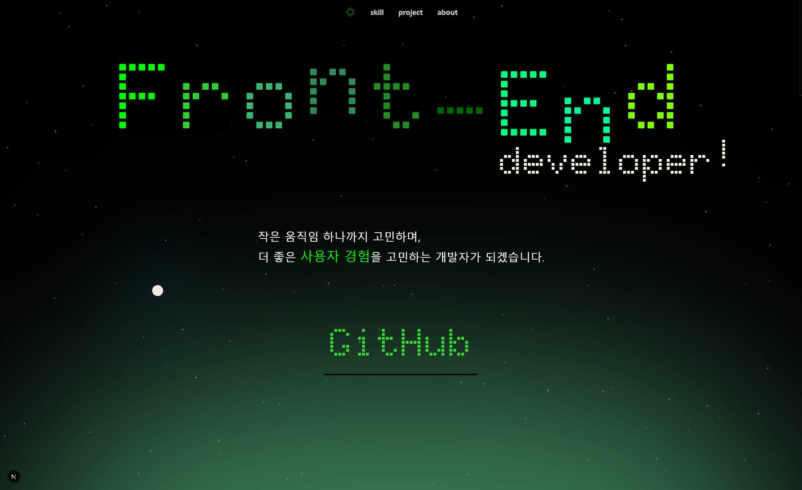

# 프론트엔드 개발자 포트폴리오

## 프로젝트 소개

이 프로젝트는 프론트엔드 개발자로서의 역량과 프로젝트를 소개하기 위한 포트폴리오 웹사이트입니다. 사용자 경험을 중시하는 인터랙티브한 웹 경험을 제공하기 위해 다양한 애니메이션과 시각적 요소들을 활용했습니다.



## 주요 기능

- **인터랙티브한 히어로 섹션**: GSAP를 활용한 텍스트 애니메이션과 타이밍 효과
- **마우스 인터랙션**: 마우스 움직임에 반응하는 라이트 이펙트와 요소 반전 효과
- **파티클 배경**: 동적인 배경 효과로 시각적 경험 향상
- **프로젝트 쇼케이스**: 개발한 프로젝트들의 상세 정보를 소개
- **스킬 섹션**: 기술 스택과 개발 역량을 시각적으로 표현
- **자기소개**: 개발자로서의 철학과 배경을 소개

## 기술 스택

- **프레임워크**: Next.js (App Router)
- **스타일링**: TailwindCSS
- **애니메이션**: GSAP,Lenis
- **언어**: TypeScript
- **컴포넌트**: UI 컴포넌트 (shadcn/ui 활용)

## 주요 섹션

### 1. 히어로 섹션

Front-End Developer 타이틀과 함께 개발자 소개 메시지가 애니메이션으로 표시됩니다. 사용자 경험에 대한 철학을 강조하는 문구들이 자연스럽게 전환됩니다.

### 2. 스킬 섹션

프론트엔드 개발에 필요한 다양한 기술 스택들을 시각적으로 표현합니다. React, Next.js, TailwindCSS 등의 기술과 함께 아이콘으로 직관적인 이해를 돕습니다.

### 3. 프로젝트 섹션

지금까지 개발한 프로젝트들을 소개하며, 각 프로젝트의 기술 스택, 주요 기능, 배운 점 등을 상세하게 설명합니다.

### 4. 자기소개 섹션

개발자로서의 성장 과정, 개발 철학, 그리고 앞으로의 목표에 대해 소개합니다.

## 특징적인 UI/UX 요소

- **마우스 라이트 효과**: 마우스 포인터를 따라다니는 빛 효과로 인터랙션 강화
- **마우스 반전 효과**: 요소 위에 마우스가 올라갔을 때 시각적인 반전 효과
- **파티클 배경**: 동적인 파티클로 페이지에 생동감 부여
- **스무스 스크롤**: 부드러운 페이지 전환 경험 제공
- **반응형 디자인**: 다양한 화면 크기에 최적화된 레이아웃

## 프로젝트 구조

```
app/                  # Next.js App Router 구조
components/           # UI 컴포넌트들
  portfolio/          # 포트폴리오 관련 컴포넌트
    layout/           # 레이아웃 관련 컴포넌트 (배경, 마우스 효과 등)
  ui/                 # 재사용 가능한 UI 컴포넌트
data/                 # 프로젝트 데이터
hooks/                # 커스텀 훅
lib/                  # 유틸리티 함수
public/               # 정적 파일 (이미지, 아이콘 등)
```
